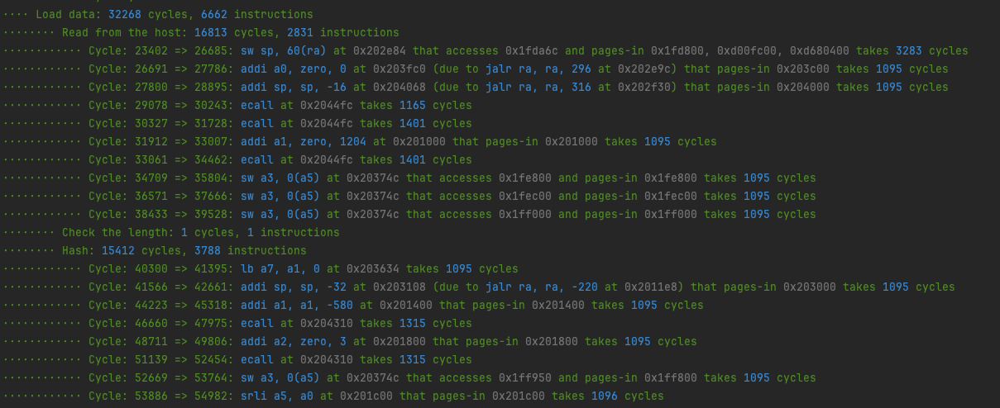

# Walking on water with this profiler for RISC Zero


This repo presents a plugin for RISC Zero programs that counts the number of cycles contributing by different parts of the program, 
detects execution steps that lead to significant number of cycles, and explains the underlying reasons.

Developers can add `start_timer!`, `stop_start_timer!`, and `stop_timer!` in the program to trace where the cycles come from. An example
is as follows.

```rust
start_timer!("Load data");
......

    start_timer!("Read from the host");
    ......

    stop_start_timer!("Check the length");
    ......

    stop_start_timer!("Hash");
    ......

    stop_timer!();

stop_timer!();
```

The profiler will output colorized information about the breakdown of the cycles. Specifically, if the profiler sees a single execution step 
that, however, leads to a large number of cycles, it would call it out and find out the underlying reasons. 

One may ask why we say this profiler is "walking on water". This is because, unlike prior solutions based on `eprintln!`, the profiler itself tries 
very hard not to affect the original execution, in particular the cycle count, of the program. 



## How to use?

There are necessary changes that need to be made on the RISC Zero program's host and guest.

#### Host

The host should have [cycle_trace.rs](host/src/cycle_trace.rs) in place and use `ExecutorEnv` to run the program.

```rust
let cycle_tracer = Rc::new(RefCell::new(CycleTracer::default()));

let env = ExecutorEnv::builder()
        .write_slice(&task.a)
        .write_slice(&task.b)
        .write_slice(&task.long_form_c)
        .write_slice(&task.k)
        .write_slice(&task.long_form_kn)
        .trace_callback(|e| {
            cycle_tracer.borrow_mut().handle_event(e);
            Ok(())
        })
        .build()
        .unwrap();

let mut exec = ExecutorImpl::from_elf(env, METHOD_ELF).unwrap();
let _ = exec.run().unwrap();

cycle_tracer.borrow().print();
```

In the example above, we first create the cycle tracer.

```rust
let cycle_tracer = Rc::new(RefCell::new(CycleTracer::default()));
```

Then, we use `trace_callback` to ask `ExecutorEnv` to send back execution trace to the profiler.

```rust
.trace_callback(|e| {
    cycle_tracer.borrow_mut().handle_event(e);
    Ok(())
})
```

After the execution is done, ask the cycle tracer to output the profiling results.
```rust
cycle_tracer.borrow().print();
```

#### Guest

Guest also has its own [cycle_trace.rs](methods/guest/src/cycle_trace.rs). Put it in place.

When the program starts, as shown below.

```rust
fn main() {
    cycle_trace::init_trace_logger();
    start_timer!("Total");
    ......
    stop_timer!();
}
```

We first initialize the trace logger.
```rust
cycle_trace::init_trace_logger();
```

Then, the guest can use the macros to break down the program into smaller pieces for examination.

## How does it work?

The way that the profiler works is similar to a hardware watchpoint. 

When the guest program starts, the guest-side cycle tracer---uses some dummy instructions (writing to the zero register)---to notify the 
host-side cycle tracer about the buffers to be watched. The code is [here](https://github.com/l2research/profiler0/blob/main/methods/guest/src/cycle_trace.rs#L14C5-L28C6).
```rust
#[inline(always)]
pub fn init_trace_logger() {
    unsafe {
        core::arch::asm!(
            r#"
            nop
            li x0, 0xCDCDCDCD
            la x0, TRACE_MSG_CHANNEL
            la x0, TRACE_MSG_LEN_CHANNEL
            la x0, TRACE_SIGNAL_CHANNEL
            nop
        "#
        );
    }
}
```

The host-side cycle tracer will then watch over these three channels. If the program writes data to these memory locations, the host-side cycle tracer can 
catch these changes and get the information in the channels.

For example,

- `start_timer!(msg)` copies the message `msg` into `TRACE_MSG_CHANNEL` and writes the message length into `TRACE_MSG_LEN_CHANNEL`, which triggers the host-side
  cycle tracer to mark that a new timer has started.
- `end_timer!()` writes a zero into `TRACE_SIGNAL_CHANNEL`, which triggers the host-side cycle tracer to mark that the previous timer has stopped.

Both timers are designed to be minimalistic, in that we want them not to incur too many cycles. This is a significant improvement from previous approach that uses 
`eprintln!("{}", env::get_cycle_count());` in the guest, which would by itself create a lot of cycles and affect the calculation.

## Limitations

Note that a profiler only sees memory writes, but not memory reads. Therefore, although the cycle count is correct, the profiler can only explain a fraction of the 
significant instructions on where the cycle comes from. More specifically,

- if an instruction makes a clean page dirty, the profiler can explain which page is made dirty.
- if an instruction loads a new page, the profiler cannot explain which page is being loaded by this instruction.
- if an instruction loads a new page and immediately makes it dirty (this is the case of allocating from the heap), the profiler can explain the cycles related to the
  page being dirty, but not the cycles related to the pages being loaded for the first time.

Another limitation is that all the cycles that occur when a new segment starts would be counted toward the first instruction immediately after it. These instructions would 
have an enormous number of cycle, for the following reasons.

- If the instruction was originally planned to be put in the previous segment but there is insufficient space, the previous segment will be closed early with dummy cycles.

- When the new segment starts, there are a number of cycles for pre-loading and post-loading.

- Now that the new segment has no loaded pages, and no pages have been marked as dirty. This instruction can trigger many page operations. Assume that this instruction is a
  syscall for 256-bit modular reduction, in the worse case, each of `x`, `y`, `modulus` crosses two pages and does not overlap, and `res` also crosses two pages that does not
  overlap, and the instruction for the syscall itself may appear in a new page. The 9 pages could even share only the root-level page table but none of 1st, 2nd, 3rd, 4th page
  tables---making sure that `x`, `y`, `modulus`, `res` crosses on very, very special locations. Note that `res` might have not been read before, and therefore it loads pages as
  well as marks those pages as dirty. This can already load 37 pages and mark 11 pages as dirty. 

To avoid confusion, the profiler will highlight the first instruction in a new segment. 

If you want to have a more precise analysis of paging, consider using GDB with the RISC-Zero-specific GDB stub: 

<p align="center">
    https://github.com/l2research/gdb0
</p>

This GDB stub provides commands to query the current cycles, the number of loaded pages, and the number of dirty pages.

## License

Please refer to [LICENSE](./LICENSE).
